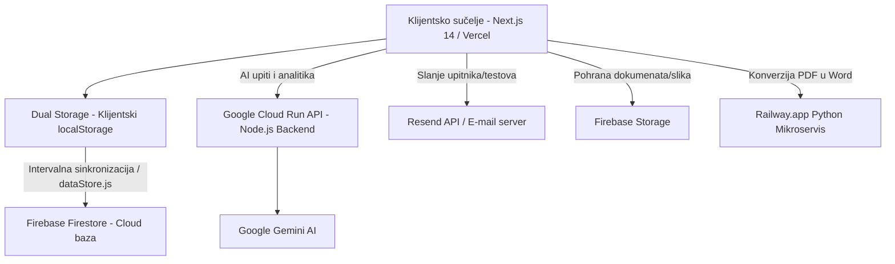

# eZNR — Sustav za digitalno upravljanje zaštitom na radu (ZNR)

eZNR je napredna SaaS web aplikacija razvijena s ciljem digitalizacije, automatizacije i pojednostavljenja cjelokupnog procesa zaštite na radu (ZNR), zaštite od požara (ZOP) te praćenja zdravstvenih i stručnih uvjerenja zaposlenika. Sustav je u potpunosti usklađen sa zakonskim propisima i pravilnicima **Republike Hrvatske** i **Bosne i Hercegovine**.

Aplikacija zamjenjuje tradicionalne papirnate registratore i nepregledne Excel evidencije modernim, centraliziranim digitalnim rješenjem koje stručnjacima za zaštitu na radu i voditeljima ljudskih resursa omogućuje profesionalno, efikasno i pravno usklađeno vođenje poslovanja.

---

## 🎯 Svrha i ciljna skupina

### Svrha aplikacije
Ubrzavanje operativnih procesa, eliminacija ljudskih grešaka u praćenju zakonskih rokova, te smanjenje rizika od visokih kazni inspekcije rada kroz:
- **Automatizirano praćenje rokova**: Uvjerenja o osposobljenosti, periodički liječnički pregledi za radnike na poslovima s posebnim uvjetima rada, periodički pregledi radne opreme i strojeva.
- **AI-potpomognuta analitika**: Integrirani pametni asistent koji analizira radna mjesta i automatski upozorava na zakonske obveze.
- **Brzo i digitalno poslovanje**: Digitalno zaduživanje osobne zaštitne opreme (OZO), automatizirano testiranje radnika i digitalna arhiva dokumenata.

### Kome je namijenjena?
1. **Stručnjaci za zaštitu na radu (ZNR)**: Glavni korisnici koji svakodnevno vode evidencije, prate rokove, provode ispitivanja i izrađuju procjene rizika.
2. **HR i administracija**: Sekundarni korisnici koji unose zaposlenike, prate radni staž, ugovore o radu i zdravstvene statuse.
3. **Uprava i menadžment (Direktori)**: Pristup analitičkom dashboardu radi uvida u opću razinu sigurnosti i usklađenosti s propisima te prevencije pravnih rizika.

---

## 🏗️ Tehnička arhitektura sustava

eZNR koristi hibridnu, troškovno optimiziranu i visokoresponzivnu arhitekturu namijenjenu brzom i stabilnom radu na svim vrstama uređaja:



### 1. Frontend i Sučelje
- **Framework**: **Next.js 14/16 (App Router)** s **React 19** (JavaScript bez TypeScripta).
- **Stilizacija (Vanilla CSS)**: Sučelje je u potpunosti stilizirano pomoću čistog CSS-a i CSS varijabli. Izbjegnuti su teški okviri poput Tailwinda ili Bootstrapa. Time je osigurana maksimalna brzina učitavanja i fluidan rad na starijim računalima.
- **Svijetli / Tamni mod (Light/Dark Theme)**: Puna podrška implementirana na razini cijele aplikacije kroz CSS varijable i automatsko tamno prilagođavanje sistemskih komponenti (npr. kalendari, date inputi).
- **Prilagodba za mobilne uređaje**:
  - **Fiksna bottom navigacija** (56px) i **bottom-sheet drawer** (88vh) za intuitivno mobilno korištenje.
  - Podrška za geste poput **Pull-to-Refresh** i **Long Press kontekstualni izbornik** (0.5s) na mobilnim tablicama.

### 2. Hibridni model pohrane podataka (Dual Storage)
Sustav koristi **offline-first** pristup za pohranu i dohvat podataka:
- **`localStorage` (Primarni sloj)**: Sve CRUD operacije nad radnicima, uvjerenjima, opremom i incidentima izvršavaju se trenutno u pregledniku putem `src/lib/dataStore.js` (prefiks ključeva: `eznr_`). Time je postignuta latencija sučelja od 0ms i omogućen rad u offline načinu rada.
- **`Firebase Firestore` (Sekundarni sloj / Sinkronizacija)**: Podaci se u pozadini sinkroniziraju s Firestore cloud bazom podataka preko modula `src/lib/firebaseSync.js`. Sinkronizacija služi kao backup i omogućuje pristup podacima s drugih uređaja.
- **Javni izuzetak**: Sesije upitnika i odgovori radnika žive isključivo u Firestore-u kako bi im se moglo pristupiti putem javnih linkova bez potrebe za prijavom i lokalnom pohranom.
- **`Firebase Storage`**: Koristi se za izravno učitavanje i pohranu fizičkih dokumenata (skenovi liječničkih nalaza, uvjerenja, dokumentacija vozila i strojeva).

### 3. Google Cloud Run i AI Backend
- Zahtjevni AI algoritmi izdvojeni su iz Next.js serverless funkcija i migrirani na samostalni Node.js Express poslužitelj na **Google Cloud Run**-u. Time su eliminirani timeouti na Vercelu i smanjeni troškovi obrade.
- Integracija s **Google Gemini API** (1.5 Flash / 2.0 Flash) pokreće sve pametne module u aplikaciji.

### 4. Komunikacija i vanjski mikroservisi
- **Resend API**: Slanje e-pošte (slanje testova, podsjetnika i dnevnih sažetaka isteklih dokumenata) s domene `noreply@mail.zastitanaradu.ba`.
- **GCP Cloud Scheduler**: Pokreće automatski dnevni pregled isteklih rokova u 07:00h te šalje e-mail izvještaj stručnjacima.
- **Railway.app Python Mikroservis**: Koristi se za brzu i preciznu konverziju dokumenata iz PDF-a u Word (npr. kod eksporta procjene rizika).

---

## ⚙️ Tehničke specifikacije i podatkovni modeli

### Multi-tenancy (Izolacija podataka)
Cijeli sustav podržava upravljanje s više tvrtki s jednog korisničkog računa.
- Podaci su strogo segmentirani pomoću polja `companyId`. Svaki upit i CRUD operacija filtriraju se prema aktivnoj firmi.
- **Sigurnost**: Firestore bazu štite **Firestore Security Rules** koji sprječavaju neautorizirani pristup podacima drugih tvrtki. Integriran je i automatizirani penetracijski test (`/dashboard/pen-test`) koji provjerava izolaciju baze i potvrđuje pogrešku `permission-denied` u slučaju neovlaštenog upita.
- **Role-Based Access Control (RBAC)**: Podržane su uloge SuperAdmin (pristup agregiranim podacima svih tvrtki) i Safety Officer (pristup isključivo dodijeljenim tvrtkama).

### Autentifikacija i Biometrija (WebAuthn)
- Uz klasičnu prijavu, eZNR implementira **WebAuthn standard** za prijavu biometrijom (otisak prsta ili prepoznavanje lica).
- Korisnik nakon prve uspješne prijave može povezati svoj uređaj, a svaka sljedeća prijava se odvija trenutno bez upisivanja lozinke.
- Modul radi isključivo putem zaštićene veze (HTTPS).

### Nepostojanje nativnih Time Inputa
Zbog čestih problema s AM/PM formatom na mobilnim operativnim sustavima (iOS/Android), u potpunosti su uklonjeni nativni `<input type="time">` elementi. Vrijeme je standardizirano na **24-satni format** te se unosi putem prilagođenih padajućih izbornika (Sati: 00-23, Minute u intervalima 00/15/30/45).

---

## ⚖️ Zakonska usklađenost (Hrvatska i Bosna i Hercegovina)

Sustav je programski usklađen s ključnim propisima u regiji, omogućujući automatsku pravnu kontrolu:

1. **Članak 40. ZNR FBiH (Noćni rad)**:
   - Ako se radno mjesto unutar sustava definira sa smjenom u rasponu od **22:00 do 06:00** sati, sustav automatski detektira noćni rad. U profilu svakog radnika na tom radnom mjestu pojavljuje se crveno zakonsko upozorenje: *“Obavezan ljekarski pregled 1x u 2 godine (Noćni Rad - ZNR čl. 40)”*.
2. **Članak 118. Zakona o radu FBiH (Sistematizacija)**:
   - Modul za sistematizaciju radnih mjesta sadrži 7 zakonski obveznih polja (Naziv posla, Kategorija radnog mjesta, Složenost posla, Probni rad, Odgovornosti, Potrebne obuke, Pravni osnov).
3. **Zapisnik o ocjeni osposobljenosti (ZOS)**:
   - Sukladno zakonodavstvu, ZOS nema fiksni rok trajanja već vrijedi trajno dok radnik radi na istom radnom mjestu. Prilikom promjene radnog mjesta unutar aplikacije, sustav automatski označava stari ZOS nevažećim i zahtijeva izdavanje novog.
4. **Putni nalozi po Zakonu o cestovnom prijevozu**:
   - Modul za vozni park generira i ispisuje zakonski propisane putne naloge **PN-3** (teretna vozila) i **PN-4** (putnička vozila) s točnim poljima i tablicama spremnim za ručno ispunjavanje.

---

## 📦 Pregled modula i funkcionalnosti

Aplikacija se sastoji od preko **64 povezane stranice i pod-modula**:

- **Nadzorna ploča (Dashboard)**: Agregirana statistika, interaktivni kalendar, notifikacijski centar koji dijeli upozorenja po razinama ozbiljnosti (urgent, info, critical).
- **Evidencija radnika (Workers)**: CRUD evidencija, osobni karton, izračun staža i životne dobi, upload fotografije.
- **Uvjerenja i certifikati (Certificates)**: Praćenje valjanosti ispita, sustav obnove jednim klikom ("Obnovi" gumb duplicira stari certifikat i štedi vrijeme).
- **Osobna zaštitna oprema (OZO / PPE)**: Katalog opreme, evidencija zaduženja, praćenje rokova trajanja opreme.
- **Radna oprema i strojevi (Equipment)**: Praćenje servisa i periodičkih tehničkih pregleda te ispitivanja.
- **Vozni park (Fleet Management)**: Evidencija vozila, statusi registracije/tehničkog pregleda/osiguranja kroz vizualne semafore, zaduženja vozila i povijest kilometraže.
- **Zaštita od požara i Evakuacija**: Moduli za planove evakuacije, periodičke vježbe i protupožarnu opremu (gated pod Premium/Enterprise pretplatom).
- **Digitalni Upitnici i Obuke**: Drag-and-drop graditelj testova, automatsko ocjenjivanje, slanje mailom s unikatnim tokenom, rješavanje bez prijave.
- **Procjena rizika**: Najsloženiji modul s **5x5 interaktivnom matricom rizika** (zelene, žute, narančaste, crvene i crne ćelije s brojačima), AI generiranjem mjera i kompletnim PDF/Word eksportom.

---

## 🤖 Zia — AI Asistent

Zia je integrirani agent temeljen na umjetnoj inteligenciji koji olakšava navigaciju i rad sa sustavom:
- **Draggable FAB sučelje**: Zia lebdi u obliku mjehurića na ekranu, automatski se lijepi za rubove i pamti svoju poziciju u klijentskoj memoriji.
- **Function Calling**: Zia može samostalno izvršavati akcije u sustavu na temelju vašeg govora ili teksta. Može navigirati stranicama, pretraživati radnike, izlistati istekle certifikate ili zadužiti radnika opremom (npr. *"Zaduži Marka s novim cipelama"*).
- **Proaktivni jutarnji brifing**: Kada se prijavite u sustav, Zia skenira bazu i generira kratki sažetak kritičnih događaja i isteka koji vas očekuju tog dana.

---

## 🚀 Kako pokrenuti projekt lokalno

### Preduvjeti
- Instaliran **Node.js** (verzija 18 ili novija)
- Pristup **Firebase** projektu i **Google Cloud** platformi (za AI funkcionalnosti)

### Instalacija i pokretanje
1. Klonirajte repozitorij:
   ```bash
   git clone https://github.com/wallmaniac/eZNR.git
   cd eZNR
   ```
2. Instalirajte ovisnosti (dependencies) unutar `app` mape:
   ```bash
   cd app
   npm install
   ```
3. Postavite `.env.local` datoteku s potrebnim ključevima (Firebase konfiguracija, Google Gemini API, Resend API). Primjer konfiguracije:
   ```env
   NEXT_PUBLIC_FIREBASE_API_KEY=tvoj_api_key
   NEXT_PUBLIC_FIREBASE_AUTH_DOMAIN=tvoj_auth_domain
   NEXT_PUBLIC_FIREBASE_PROJECT_ID=tvoj_project_id
   NEXT_PUBLIC_FIREBASE_STORAGE_BUCKET=tvoj_storage_bucket
   NEXT_PUBLIC_FIREBASE_MESSAGING_SENDER_ID=tvoj_sender_id
   NEXT_PUBLIC_FIREBASE_APP_ID=tvoj_app_id
   NEXT_PUBLIC_GEMINI_API_KEY=tvoj_gemini_key
   RESEND_API_KEY=tvoj_resend_key
   RESEND_FROM_EMAIL=noreply@mail.zastitanaradu.ba
   ```
4. Pokrenite razvojni poslužitelj (development server):
   ```bash
   npm run dev
   ```
5. Otvorite [http://localhost:3000](http://localhost:3000) u svom pregledniku.

---

## 📈 Poslovni potencijal i faze daljnjeg razvoja (Roadmap)

Za potrebe komercijalizacije aplikacije eZNR na tržištima regije, definirane su faze nadogradnje sustava iz funkcionalnog prototipa u cjelovito enterprise rješenje:

### 🛠️ Faza 1: Migracija baze i sigurna autorizacija (Procjena: 25 - 35 radnih dana)
- Zamjena klijentskog `localStorage` spremanja kompletnom bazom podataka na strani poslužitelja (npr. PostgreSQL ili Firestore kao primarna baza podataka).
- Implementacija napredne autentifikacije (JWT, višefaktorska autentifikacija - MFA, oporavak lozinki).
- Uvođenje finih razina administratorskih rola (Role-Based Access Control - RBAC).

### ☁️ Faza 2: Napredne integracije i datoteke (Procjena: 15 - 20 radnih dana)
- Puna integracija Firebase Storage-a za dokumente zaposlenika.
- Automatski email i SMS podsjetnici za isteke uvjerenja/servisa integrirani na razini poslužitelja (cron poslovi).
- Sinkronizacija podataka u realnom vremenu za više istovremenih korisnika unutar iste tvrtke.

### 📄 Faza 3: Izvještavanje i administracija (Procjena: 10 - 15 radnih dana)
- Generiranje službenih PDF obrazaca usklađenih s državnim pravilnicima Hrvatske i BiH (npr. ZOS obrazac, evidencijski kartoni).
- Masovni uvoz podataka (Bulk Import) iz postojećih Excel tablica klijenata za brzo postavljanje sustava.
- Napredni analitički i BI (Business Intelligence) izvještaji za uprave tvrtki.

### 📱 Faza 4: Mobilna aplikacija i PWA (Procjena: 20 - 30 radnih dana)
- Razvoj **React Native** mobilne aplikacije ili optimizacija u **Progressive Web App (PWA)** s podrškom za offline rad na terenu (gradilišta, tvornički pogoni) bez stabilne internetske veze.
